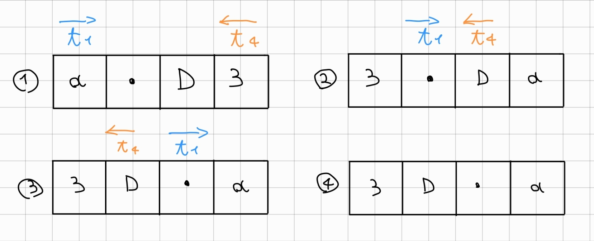
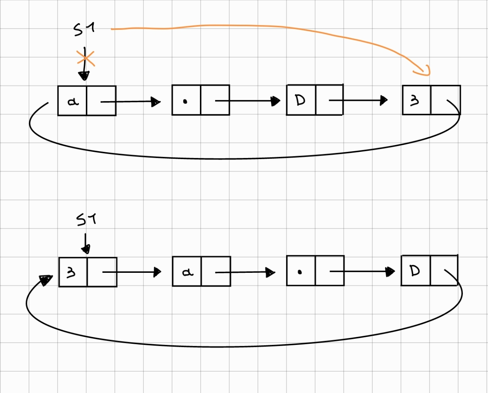
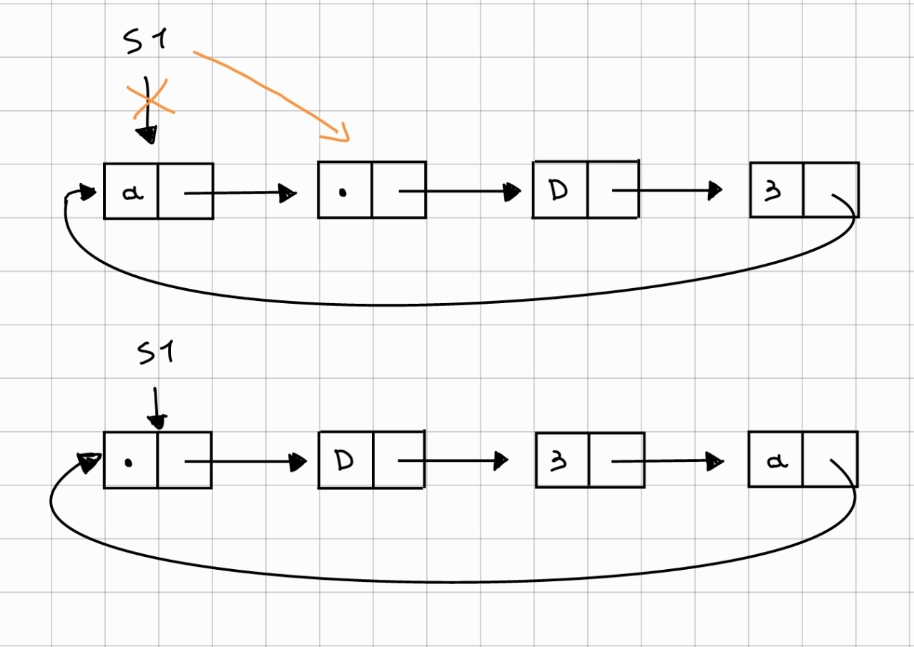
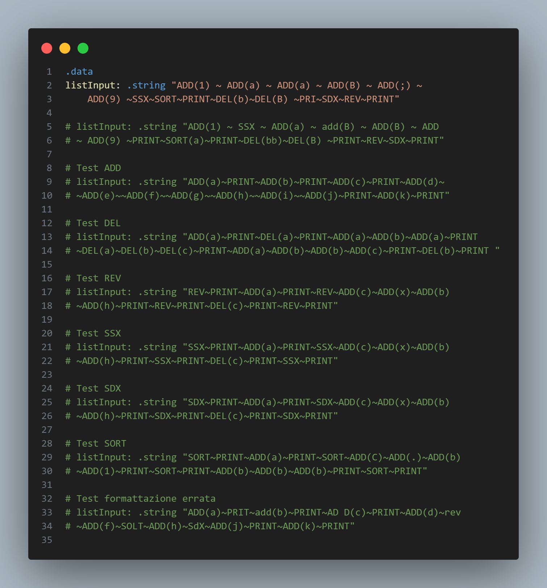

---
author:
- Author Name
- |
  Matteo Becatti\
  matteo.becatti@stud.unifi.it\
  7006081
title: |
  Management of Circular Lists in RISC-V\
  Computer Architecture Project 22-23\
  
---

# Parsing

## Input Parsing

Inputs are passed to the program through the *listInput* string, which
contains the various instructions, separated from each other by a tilde.\
The first step is to check if there are spaces at the beginning of the
string, using *check_initial_spaces*. As long as there are spaces,
we ignore them and move on to the next character.

Characters are read one at a time. A simplified version of the
process performed by the program is illustrated in the following image:

{#fig:parsing-image}

We read the character and ask "Is it the letter A?" If yes, we proceed
with the formatting checks for ADD, if the answer is no, we
ask "Is it the letter P?" and so on for all the other initials.
For each operation, a very similar process is followed, and the
differences between them can be divided into three categories. The names
of the checks follow the form *check_instructionname*, e.g. *check_add*
for ADD.

All checks end with a jump-and-link to the respective
list instruction. When the instruction is completed, the program
counter returns to the point from which it was called using the return
address. The next line is always *"j check_next_instruction"*

## ADD, DEL

The parsing of ADD and DEL is identical, so for the explanation we take
ADD as an example. The correct syntax must follow the form ADD(n),
where n is the element to be added to the list, and can only be a
single character. Once the A is read, we proceed to the next characters, making the necessary checks. We read D twice, and then
check that there is an open parenthesis. Now we need to read the
value to be added to the list. We save it in the a2 register, so
that it can be passed as a parameter later, and we verify
that it falls within an acceptable range of ASCII values (not all values
are allowed). We make sure that the instruction is formatted
correctly with the parenthesis closed at the end, and jump
to the ADD instruction to add the new element to the list.

### jump-and-link

At the end of the checks, and after verifying that there are no blank spaces
through the *check_spaces* procedure, a
*jump-and-link* is made to the ADD instruction. The element to be added is
passed as a parameter, and the position of the program counter is
automatically saved in the return address. We do not expect return values. When the ADD is completed, we return to the address saved
in the ra, and the next step is to jump to
*check_next_instruction*. This procedure is the same for DEL,
obviously in this case the parameter is not the element to be added,
but the one to be removed. For the other functions, no parameters are passed.

## PRINT, REV

PRINT and REV are simpler than ADD and DEL. They perform the control
on the formatting of the letters, but not having parameters to manage, they jump directly to the respective instruction, without needing
to touch the registers to save data.

## SORT, SDX, SSX

So far the instructions all had different initials. SORT, SDX and
SSX instead all start with S. This time the program first checks on S, and then verifies what is the next letter,
and based on what it reads it proceeds to the respective procedure.
Also in this case there are no parameters to manage, so
we jump directly to the corresponding procedure.

## Incorrect formatting

The program is able to handle situations where the input string is
not formatted correctly. If there are blank spaces at the beginning
or at the end of the string, or before or after a tilde, they will be
ignored. If there are spaces within the instruction, it will be
discarded. During the reading of an instruction, as soon as we find a
writing error (for example PRNT instead of PRINT), we discard the
command and move on to the next one. In the case of instructions with parameters,
if more than one character is inserted inside the parentheses, the
formatting is considered incorrect.

# Functions

## Program functions

Once the parsing of a single instruction is completed, a jump is made to the respective function. For example, when
*check_add* ends successfully, it jumps to *ADD*.

## ADD

The ADD function is responsible for inserting new elements within
the list. It starts by calling *address_generator*, which is responsible for
generating the memory address for the node that we need to add

Once the address is obtained, we check if the operation we are
doing is the first of its kind, because:

-   If the list is empty, we add the new node, synchronize it
    with the global head (s1), and set its PAHEAD (the pointer
    to the next node) to itself.

-   If the list is not empty, and therefore there is at least one element, we set
    the pointer of the new node to the head, but we also need to
    connect the tail with the new node. To do this,
    we call the *get_last_node* procedure, which returns the last
    node of the list, and we move its pointer to the newly
    added node.

### jal address_generator

To use the address generator, we need to make a
jal. The problem is that we have already made a jal from the parsing to the
ADD function, and by making another one we will lose the return address.
We can use the stack to solve this problem. We create a
stack of size 4 bytes and load the return address onto it. We call the *jal address_generator*, and on return we retrieve the return address
from the stack, and then reset it. An illustration of the behavior
of the stack pointer can be seen in the figure. As there is no need to
save parameters in the stack, its content and the respective
operations are very basic.

{#fig:stack-image width="0.75\\linewidth"}

### jal get_last_node

In the course of the code, we often need to access the last
element, but the specifications do not allow to save a global pointer
to the tail. So I wrote a function that cycles
through the list and returns the tail. Here too, however, the same problem arises as with the address generator, we need to make a
*jump_and_link* to an internal procedure. and the solution is always the
same. This time, however, we also have a return parameter, in fact
the tail node is returned through the a0 register.

### Memory Address Generator

Generates a random memory address from a provided seed. The procedure performs 4 right shifts of the seed (by 1, $2^2$, $2^3$ and $2^5$) and saves the results in 4 different temporary registers. Subsequently, these results are combined using an XOR function and the seed is shifted to the right by 2. The result of the XOR is shifted to the left by $2^{15}$ and these two values are combined using an OR function. To obtain only the first 16 bits of the OR result, an AND function is applied with the value 0x0000ffff. The output of this operation is combined using an OR function with the value 0x00010000 to obtain the generated address. This address overwrites the previous seed in case of a future call of the procedure.

Finally, the procedure checks that the memory pointed to by the address is free. If so, the function ends and returns the generated address. Otherwise, the procedure recursively calls itself to generate a new random address.

## PRINT

Prints the contents of the list, showing the elements in the same order in which they are found within the structure. It also adds square brackets to increase the clarity of reading. Even if the list is empty, brackets will be printed to show that the print has been performed, but there are no elements in the list.

The pointer to the head of the list is copied into a temporary register, giving us the ability to iterate without having to modify the original pointer. Through a check, we verify that at least one ADD operation has been performed, otherwise there would be nothing to print, and entering the loop would be superfluous, so we terminate the execution of PRINT to move on to the next function.

The print occurs within a counter loop, which continues until we reach the number of elements in the list. Each time we load into a0 the character to print, and we make the system call. At the end of the list, we close the square bracket and go to a new line.

## DEL

Deletes an element from the list. Checks if at least one ADD has been made, and if not, it ends the operation and moves on to the next one. The deletion occurs within a loop that scrolls through the list until it finds an element that matches the input parameter, or it reaches the end of the list and ends if the element is not present.

Once the element is found, we take into account its position. If the node is...

-   **at the head** of the list, it jumps to *del_first_element*. The memory occupied by the node is freed, allowing the address generator to reuse it in the event it is selected again. The pointer to the head of the list is moved to what was the second element.

-   **in an intermediate position** we jump to *del_element*. The PAHEAD of the previous node must be set to the node following the one we want to delete, and we zero the content of the node.

-   is **the only element**, we free the memory used by the node and delete the pointer. The global head pointer is in turn zeroed.

## REV

Reverses the existing list.

Using two indices, one that scrolls through the list starting from the head (left) and one from the tail (right), we swap the elements, until we find a collision between the indices. Two cases can occur:

-   Even elements: The indices will meet and overtake each other, ending the execution.

-   Odd elements: The indices will meet in the element in the middle of the list, whose position will remain unchanged. The execution ends.

If the list were bidirectional and with the possibility of saving the tail pointer, the exercise would be over here. Instead, to work, we need to do some more operations. At the beginning of each iteration of REV, there is an additional loop that scrolls through the list until it reaches the position of the right node counter. This counter decreases with each iteration as it must scroll to the left, and it allows us to pick up the leftmost node not yet swapped.

{#fig:enter-label width="0.75\\linewidth"}

## SORT

For sorting, I decided to use Bubble Sort, a sorting algorithm that compares and swaps adjacent elements in a list if they are in the wrong order. The flag variant uses a boolean variable to check if the list is already sorted and stop the algorithm if there were no swaps in the last iteration.

Initially, the flag is set to 0, as there have been no movements yet. We load the elements of the current node and the next node for comparison. If the next one is the head, we know that we have reached the last element, and we stop the SORT_loop, otherwise we proceed with the various checks within swap_check. If swap_check sets the flag to true, we jump to swap_element, which, as the name suggests, swaps the elements. Once the cycle has examined all the elements of the list, if the flag had been set to 1, SORT is called again, and the cycle starts from the beginning. SORT will be called until all elements are sorted.

### swap_check

It is responsible for comparing the two elements examined by the Bubble Sort. The project requires a certain type of priority: $extra\ character < number < lowercase\ letter < uppercase\ letter$. Each of these categories belongs to a range of ASCII values (e.g., $65\leq uppercase \leq 90$). The procedure does nothing particularly elaborate, it just does a series of "less than" and "greater than" to understand which group the two numbers to be compared belong to, and if it turns out that they need to be swapped, it sets the a2 flag to 1.

## SDX

The implementation of SDX is very simple. Through *get_last_node* we get the tail. We assign the tail to the global pointer s1. Now the list has been moved one position to the right.

{#fig:sdx-image width="0.75\\linewidth"}

## SSX

The shift to the left is even simpler than the one to the right, as we don't have to go and retrieve the last element of the list. We load the head, read the next element and assign it to the global head pointer (s1). Now the elements have been moved one position to the left.

{#fig:ssx-image width="0.75\\linewidth"}

# Testing

During development, I used different types of strings to verify the correct operation of the code. These strings were initially very simple, and as everything seemed to work correctly, I made them more complex to verify the edge cases.

I came to the conclusion that to verify the correct operation of the program, each of the list operations should work in the following cases:

-   There are no elements in the list

-   There is only one element in the list

-   There are two elements in the list

-   There is an even number of elements in the list

-   There is an odd number of elements in the list

-   There are formatting errors in the code

For this reason, in the .data section of the program, in addition to the two test strings provided in the project specifications, I added a string for each function that tested these situations. No string was added for PRINT, as all its cases of operation are visible within the tests of the other functions.

The inputs are visible in the image below. Each line has been broken into two for readability, in the original code each input is on a single line.

{#fig:enter-label width="1\\linewidth"}

## Test Results

The test results seen in the image above are visible below:

    # First input from specifications
    [ ; 1 9 a a B ]
    [ a 9 1 ; a ]
    # Second input from specifications
    [ 1 a B 9 ]
    [ 1 9 a B ]
    [ 1 9 a ]
    [ 1 a 9 ]
    # ADD test result
    [ a ]
    [ a b ]
    [ a b c ]
    [ a b c d e f g h i j ]
    [ a b c d e f g h i j k ]
    # DEL test result
    [ a ]
    [ ]
    [ a b a ]
    [ ]
    [ a b b c ]
    [ a c ]
    # REV test result
    [ ]
    [ a ]
    [ a c x b h ]
    [ h b x c a ]
    [ h b x a ]
    [ a x b h ]
    # SSX test result
    [ ]
    [ a ]
    [ a c x b h ]
    [ c x b h a ]
    [ x b h a ]
    [ b h a x ]
    # SDX test result
    [ ]
    [ a ]
    [ a c x b h ]
    [ h a c x b ]
    [ h a x b ]
    [ b h a x ]
    # SORT test result
    [ ]
    [ a ]
    [ a C . b 1 ]
    [ . 1 a b C ]
    [ . 1 a b C b b b ]
    [ . 1 a b b b b C ]
    # Incorrect formatting test result
    [ a ]
    [ a ]
    [ a d f h j ]
    [ a d f h j k ]