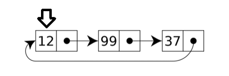

# RISC-V-Circular-Linked-List
Implementation of a circular linked list in RISC-V. Developed with Ripes.
Supports the following operations:

* ADD: Adds a new element to the list
* DEL: Removes an element from the list
* PRINT: Prints content of the list
* SORT: Sorts the list in 
* SDX: Logical Right Shift of list elements. Basically a clockwise rotation.
* SSX: Logical Left Shift of list elements. A counter-clockwise rotation.
* REV: Reverse list elements.

There is a listInput variable where the input is specified. The behaviour of the program depends on the content of this input. Commands should be separated by a tilde (~).